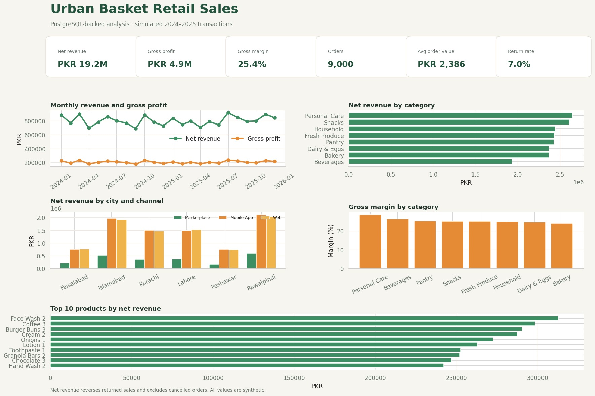
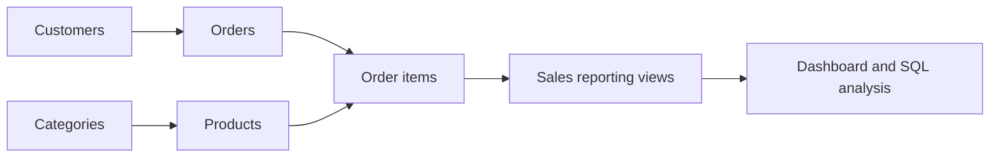

# Urban Basket Retail Sales Dashboard

[](https://www.postgresql.org/)
[](https://www.python.org/)
[](https://streamlit.io/)
[](#validation)

A portfolio-grade retail analytics project that builds a normalised PostgreSQL database, loads validated synthetic sales data, answers business questions with SQL, and presents the results in an interactive dashboard.

> All customers, orders, products, locations, and monetary values are simulated. This repository does not contain real business or personal data.



## Business questions

- How are net revenue and gross profit trending over time?
- Which categories and products contribute the most revenue?
- Which cities and channels drive the sales mix?
- Which categories have the highest return rates?
- Which products sell below their category benchmark?
- How do customer segments differ in orders and revenue per order?

## What this project demonstrates

- PostgreSQL schema design with primary keys, foreign keys, constraints, and indexes.
- A five-table retail model: categories, products, customers, orders, and order items.
- Reproducible Python generation and cleaning for **9,000 orders** and **20,124 valid order items**.
- pgAdmin-ready SQL for monthly trends, category mix, top products, city/channel sales, return rates, segments, and subquery benchmarks.
- Signed financial logic: completed sales are positive, returned sales are reversed, and cancelled orders contribute zero.
- Interactive filters for date, category, city, channel, and order status.
- Automated checks for SQL syntax, relational integrity, revenue reconciliation, KPI formulas, and dashboard behaviour.

## Simulated portfolio results

| KPI | Result | Definition summary |
|---|---:|---|
| Net revenue | PKR 19.25M | Completed revenue minus returned revenue |
| Gross profit | PKR 4.89M | Signed revenue minus signed line cost |
| Gross margin | 25.4% | Gross profit ÷ net revenue |
| Orders | 9,000 | Distinct orders in the reporting population |
| Average order value | PKR 2,386 | Net revenue ÷ completed orders |
| Return rate | 7.0% | Returned ÷ completed plus returned orders |

Full formulas are documented in [KPI definitions](docs/KPI_DEFINITIONS.md).

## Database model



See the complete entity relationship diagram in [DATA_MODEL.md](docs/DATA_MODEL.md).

## Quick start

### 1. Install Python dependencies

```bash
git clone https://github.com/zararshahid25/urban-basket-retail-dashboard.git
cd urban-basket-retail-dashboard
python -m venv .venv
pip install -r requirements.txt
```

### 2. Generate and clean the data

```bash
python -m src.generate_data
python -m src.prepare_data
```

### 3. Start PostgreSQL and pgAdmin

```bash
cp .env.example .env
# Replace the example passwords in .env
docker compose up -d
```

### 4. Load PostgreSQL

```bash
python -m src.load_postgres
```

pgAdmin is available at `http://localhost:5050`. Follow [PGADMIN_SETUP.md](docs/PGADMIN_SETUP.md) for exact connection and manual-import steps.

### 5. Run the dashboard

```bash
streamlit run app.py
```

The dashboard reads the same processed tables used by the PostgreSQL loader, so its calculations can be reconciled directly to the SQL view logic.

## SQL portfolio

| File | Purpose |
|---|---|
| `sql/01_schema.sql` | Tables, keys, relationships, checks, and unique constraints |
| `sql/02_indexes.sql` | Indexes for dates, joins, status, city, product, and category |
| `sql/03_views.sql` | Enriched line-level view and monthly sales view |
| `sql/04_analysis_queries.sql` | Seven business analysis questions using joins, grouping, windows, CTEs, and subqueries |
| `sql/05_data_quality_checks.sql` | Duplicate, range, orphan, and revenue-reconciliation checks |

Example category analysis:

```sql
SELECT
    category_name,
    ROUND(SUM(net_revenue), 2) AS net_revenue,
    ROUND(SUM(gross_profit), 2) AS gross_profit,
    ROUND(100.0 * SUM(gross_profit) / NULLIF(SUM(net_revenue), 0), 2) AS gross_margin_pct
FROM vw_sales_enriched
GROUP BY category_name
ORDER BY net_revenue DESC;
```

## Data-quality work

| Raw issue | Resolution |
|---|---|
| 4 duplicate order IDs | Removed duplicate order rows before loading |
| 48 inconsistent customer cities | Standardised abbreviations, case, and whitespace |
| 287 inconsistent shipping cities | Standardised through the same canonical city map |
| 6 quantities of 0 or 99 | Excluded to an exceptions file instead of silently changing them |
| Line-revenue rounding differences | Recalculated from quantity × unit price × discount |
| Missing promo codes | Preserved as null because no promotion is a valid business state |

The complete audit is stored in `reports/data_quality_summary.json`; excluded rows remain inspectable in `reports/data_quality_exceptions.csv`.

## Project structure

```text
urban-basket-retail-dashboard/
├── app.py                         # Interactive sales dashboard
├── docker-compose.yml             # PostgreSQL 16 and pgAdmin 4
├── sql/                           # Schema, indexes, views, analyses, QA checks
├── src/
│   ├── generate_data.py           # Deterministic synthetic retail generator
│   ├── prepare_data.py            # Cleaning and load-ready table creation
│   ├── load_postgres.py           # PostgreSQL COPY-based loader
│   ├── analytics.py               # Joined analysis table and KPI logic
│   └── create_assets.py           # Preview and report exports
├── data/sample/                   # Small joined sample for reviewers
├── docs/                          # Model, metrics, pgAdmin, learning guide
├── reports/                       # Quality and performance exports
└── tests/                         # SQL, schema, metric, and dashboard checks
```

## Example findings from the simulated data

- Personal Care generated the highest category net revenue at approximately **PKR 2.65M**.
- Beverages produced the lowest category net revenue at approximately **PKR 1.93M**, while still maintaining a simulated margin above 26%.
- Mobile App and Web were the dominant channels across major cities; Marketplace contributed a smaller share.
- These observations are descriptive results from generated data and do not prove why a category or channel performed differently.

## Validation

```bash
python -m pytest -q
```

The five tests validate:

1. clean keys, accepted quantity ranges, and line-revenue formulas;
2. every SQL file in PostgreSQL dialect;
3. the relational schema and load order in an independent in-memory database;
4. signed revenue and profit KPI reconciliation;
5. dashboard loading and filter-driven recalculation.

## Author

**Zarar Shahid**  
[LinkedIn](https://www.linkedin.com/in/zarar-shahid-0768aa349/) · [GitHub](https://github.com/zararshahid25)

