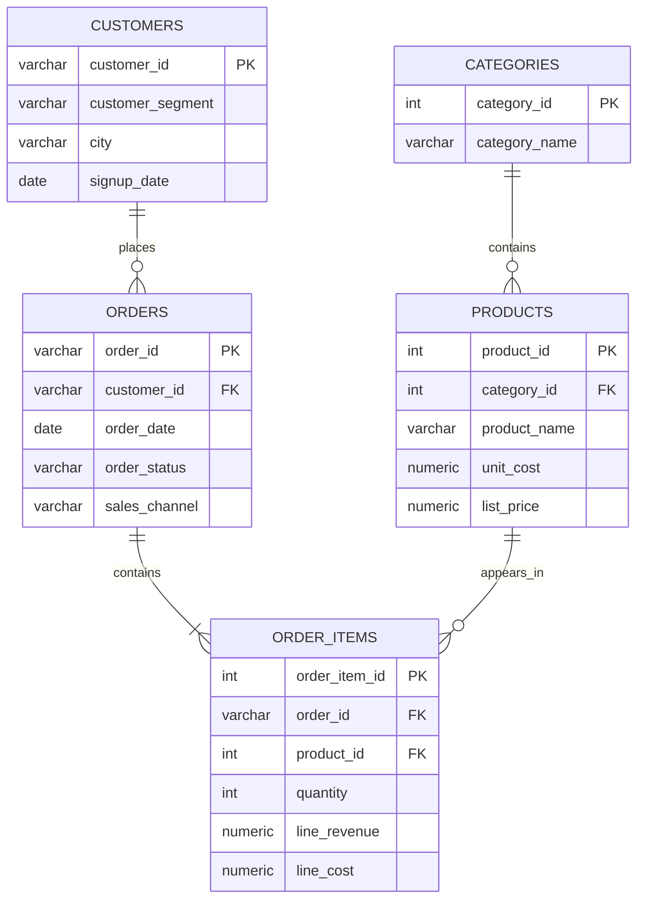

# Data model

## Grain

- `orders`: one row per order.
- `order_items`: one row per product within an order.
- `vw_sales_enriched`: one row per order item with order, customer, product, and category attributes.

The schema keeps category, product, customer, order, and item attributes in separate related tables. Analytical views provide a convenient denormalised surface without duplicating source entities.

