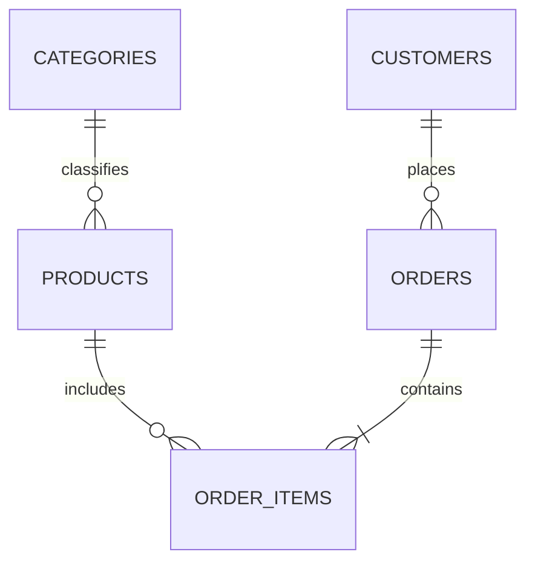

# Data model and dictionary

| Table | Grain / primary key | Fields and relationships |
|---|---|---|
| categories | Category / category_id | Unique category_name |
| products | Product / product_id | category_id FK, product_name, brand, unit_cost, list_price, active_flag |
| customers | Customer / customer_id | customer_segment, canonical city, signup_date |
| orders | Order / order_id | customer_id FK, order_date, order_status, sales_channel, shipping_city, courier_name, payment_method, promo_code |
| order_items | Line / order_item_id | order_id FK, product_id FK, quantity, unit_price, discount_pct, line_revenue, line_cost; unique order/product pair |

Raw staging separates capture from constrained storage. raw_orders.source_row preserves import sequence. data_issues has one row per issue/action; multiple issues can refer to one record, so its row count is not a rejected-order count.

## Reporting star

`retail.sales_enriched` becomes FactSales. DimProducts uses `retail.dim_products`, DimCustomers uses `retail.customers`, and DimDate uses `retail.dim_date`. Three dimensions filter the fact in one direction. Date coverage is 1 January 2024–31 December 2025, including leap day (731 dates).

| Fact fields | Meaning / type |
|---|---|
| order_item_id, product_id | Integer keys; never sum |
| order_id, customer_id | Text identifiers |
| order_date, order_month | Date and month-start date |
| order_status | Completed, Returned, Cancelled |
| sales_channel | Web, Mobile App, Marketplace |
| shipping_city | Canonical shipping city |
| product_name, category_name, customer_segment | Descriptions; hidden in native fact in favor of dimensions |
| quantity, net_units | Accepted and signed unit counts |
| unit_price, unit_cost | PKR per unit |
| discount_pct | Percent in 0–100 units |
| line_revenue, line_cost | Rounded unsigned PKR |
| net_revenue, gross_profit | Signed PKR |

DimDate adds month, year_month, month_number and year. Sort year_month by month. Model money fields use fixed decimal; SQL uses NUMERIC. This simulated fixture contains no real customer names, addresses or contact details.
